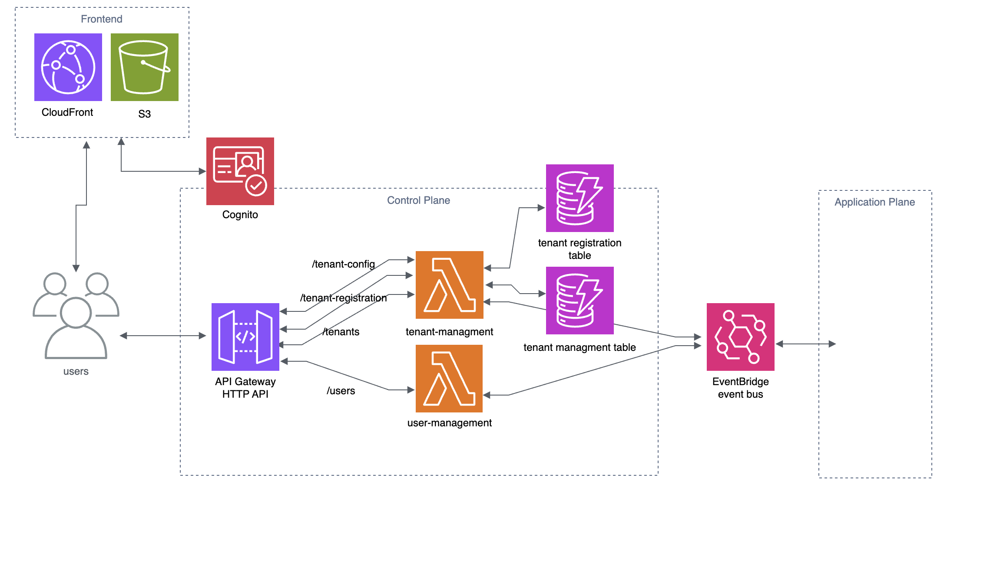

<h1 align="center">
  TenancyKit
  <br>
</h1>

<p align="center">
  Serverless multi‑tenant SaaS kit for AWS (CDK/TypeScript)
</p>

<p align="center">
  <a>
    
  </a>
  <a href="https://d1ww2wzcm0dott.cloudfront.net/"></a>
</p>

**TenancyKit** is an opinionated kit for building serverless, multi-tenant SaaS applications on AWS using the [AWS Cloud Development Kit (CDK)](https://aws.amazon.com/cdk/) in TypeScript. It provides reusable building blocks and example code for the control plane—authentication, user management, and tenant lifecycle—implemented with AWS Lambda, API Gateway, DynamoDB, Cognito, and EventBridge.

Use TenancyKit as both a starting point and a reference. The constructs are designed to be swapped or extended and provide some types to allow using other implementations of various services like auth or billing. The project aims to embrace open standards like [OpenTelemetry](https://opentelemetry.io/) and [CloudEvents](https://cloudevents.io/) in the future for observability and interoperability. TenancyKit is not a turnkey SaaS product; it’s production‑minded scaffolding that demonstrates tenant onboarding, auth, billing, metering, and basic user flows.

A minimal Next.js placeholder static site is included to showcase a landing page, sign‑up/login, and a simple dashboard. It’s intentionally lightweight and not fully tenant‑aware. Replace or extend it to suit your application UI.


> TenancyKit is a kit + reference, not a turnkey product. You own hardening, compliance, and app‑plane features.

## Technologies Used

- AWS CDK (TypeScript)
- Core services for the control plane: AWS Lambda, Amazon API Gateway, Amazon DynamoDB, Amazon Cognito, Amazon EventBridge 
- Next.js (for the static frontend demo) with S3 + CloudFront

## Navigating this project
```sh
.
├── bin/
│   └── multi-tenant-saas.ts   # Entry point for AWS CDK App
├── frontend/
│   ├── package.json           # Frontend dependencies (Next.js)
│   └── src/
│       └── app/
│           ├── page.tsx       # Landing page (using Next.js App Router)
│           └── ...            # Additional page routes
├── lambda/
│   └── ...                    # Lambda functions handlers
├── lib/
│   ├── auth/                  # Auth construct
│   ├── tenant-management/     # Tenant management constructs
│   ├── control-plane.ts       # Entry point of the control plane
│   └── ...                    # Additional constructs and AWS resources
└── README.md
```

- [Tenant-aware fine-grained access control using OAuth 2.0 and OIDC](./lib/auth/auth.ts)
- [Event-driven architecture with a message bus for distributed service communication](./lib/event-bus.ts)
- [Real time monitoring and logging integrated with Amazon CloudWatch](./lambda/userManagement.ts)
- [Tenant management service for registration, onboarding, and offboarding](./lib/tenant-management/tenant-management.ts)
- [Next.js static frontend demo featuring a landing page, basic dashboard, and auth integration](./frontend/src/app/page.tsx)
- [Automated CI/CD deployment with GitHub Actions](./.github/workflows/deploy.yml)

## Architecture Diagram (High-Level)



## Architecture

The project is split into three main components:

1. **Control Plane**
    - **Authentication & User Management:** Uses AWS Cognito to manage system users and tenant users. You can add tenant-specific data (like a tenant ID) directly to the Cognito user record using custom attributes.
    - **Tenant Management:** Implements a unified tenant management solution for registration, onboarding and offboarding.
    - **API Endpoints:** Provides RESTful endpoints to handle tenant registrations and related operations.

2. **Application Plane (Minimal)**
    - In this demo, not much is implemented beyond placeholders. In a real SaaS, you would add your app logic here.

3. **Frontend**
    - **Next.js Static Website:** Demonstrates a basic SaaS UI with a landing page, sign up & login, and dashboard.
    - **Basic Authentication:** Implements simple auth to protect access to demo dashboard pages.

## System Design Considerations

- Control and application planes communicate asyncronously using a message bus (EventBridge) in order to enable decoupling and scalable cross-service communication
- Isolation of failures is also achieved through the decoupled event-driven design, minimizing the impact of a service’s failure on others
- Uses clear abstractions and interfaces (e.g., [EventManager](./types/EventManager.ts), [Auth](./types/Auth.ts)) which also allows for alternate implemenations
- Security and identity context propagation is done through the tenant and user identity embedded in event metadata, which allows downstream services to be tenant-aware and enforce scoped authorization
- Each construct (ControlPlane, CognitoAuth, UserManagementService, etc) is independently deployable and composable which makes it suitable for microservice environments
- Uses AWS serverless services like Lambda, Step Functions, EventBridge, etc to automatically scale with demand and provide retry mechanisms

## Available Scripts

### Prerequisites and Setup

- [Node.js](https://nodejs.org/) (v18 or later)
- [AWS CLI](https://aws.amazon.com/cli/) configured with appropriate credentials
- [AWS CDK](https://docs.aws.amazon.com/cdk/latest/guide/getting_started.html) (v2 recommended)

>[!NOTE] 
>[Bootstrapped CDK environment required](https://docs.aws.amazon.com/cdk/v2/guide/bootstrapping-env.html)

###  From project root:
* `npx cdk bootstrap`    Bootstraps CDK resources
* `npx cdk deploy ControlPlaneStack`    Deploys the Control Plane

>[!WARNING] 
> This will create or update your AWS resources, including:
> - Cognito User Pool and App Client
> - API Gateway HTTP API
> - DynamoDB tables for tenant/user records
> - Lambda functions orchestrating create/update/delete of tenants
> - EventBridge event bus

* `npx cdk deploy FrontendStack`    Deploys the `/out` (static export) in the `/frontend` dir to CloudFront 
* `npm run build`   compile typescript to js
* `npm run watch`   watch for changes and compile
* `npm run test`    perform the jest unit tests
* `npx cdk deploy`  deploy this stack to your default AWS account/region
* `npx cdk diff`    compare deployed stack with current state
* `npx cdk synth`   emits the synthesized CloudFormation template

### For the frontend

- Add a `.env` file with the following ouputted values from the ControlPlaneStack
```sh
NEXT_PUBLIC_COGNITO_USER_POOL_ID=
NEXT_PUBLIC_COGNITO_APP_CLIENT_ID=
NEXT_PUBLIC_API_GATEWAY_ENDPOINT=https://[your-id].execute-api.us-east-1.amazonaws.com/
NEXT_PUBLIC_REGION=us-east-1
FRONTEND_DOMAIN=
```

Instructions for the frontend are [here](frontend/README.md)

## License

This project is licensed under the **[Apache License Version 2.0](./LICENSE.txt)**, a permissive free open-source license.

Disclaimer: This reference architecture is provided as-is, without warranties, and is intended for educational or prototyping purposes. For production workloads, please review and adjust security, compliance, and operational considerations accordingly.